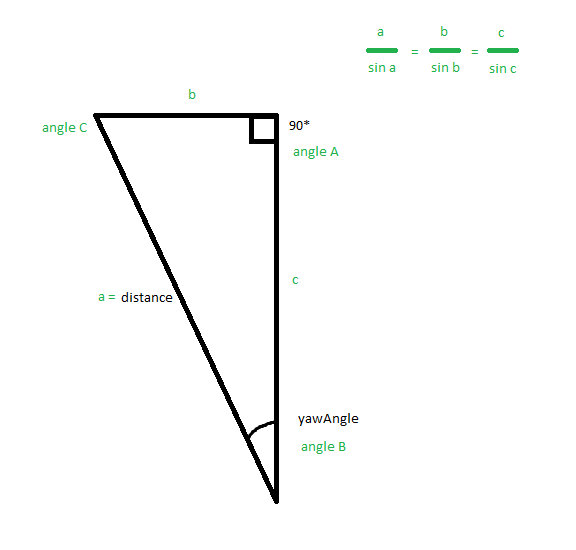

# Person (part of PeoplePerception)

## What it does
The Person class is used as part of the PeoplePerception class. On initialisation, data is provided from the PeopleDetected
data.

## Methods

### \_\_init\_\_(*data*)  
This method is called upon object creation and sets all object properties through update().

__Parameters__
- *data* - data of a person from ALPeoplePerception's PeopleDetected, as list

### seen()
Sets the lastSeen property to a new DateTime instance (UTC)

### update(*data*)
Uses the same data as the `__init__` function and sets the objects' properties such as distance, pitchAngle and yawAngle.

__Parameters__
- *data* - data of a person from ALPeoplePerception's PeopleDetected, as list

### equals(*person*)
Compares self to another object of the person class and returns True if their IDs match.

__Parameters__
- *person* - Person as instance of the Person class

### updatePosition()
The data provided by the ALPeoplePerception API makes us able to calculate an X and Y position on an axis for every person
visible to the robot. The data provided is the yawAngle (in radians), which is the angle relative to the center of the robot of where
a person is standing, and the distance from the robot (in meters). Using *maths* we can calculate the position of a person.

In this picture, the robot is at angle B and the person is at angle C.

### distanceTo(*person*)
Returns the distance (in meters) to another person.

__Parameters__
- *person* - Person as instance of the Person class